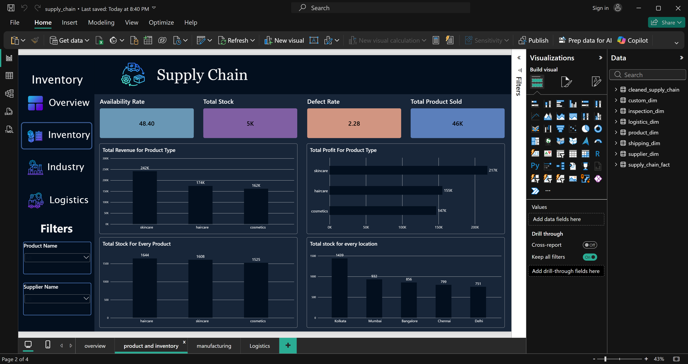
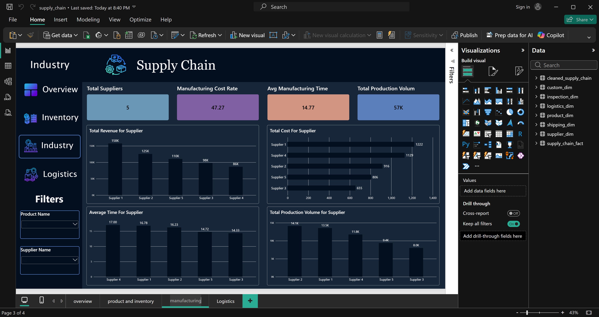

# 📦 Supply Chain Performance Analysis

## 📌 Project Overview

An end-to-end supply chain analytics project using Python and Power BI to analyze inventory levels, supplier performance, manufacturing operations, and logistics efficiency. The project transforms raw data into actionable business insights to support data-driven decision-making.

## 🛠️ Tools & Technologies

* Python
* Pandas & NumPy
* Power BI
* DAX
* Data Modeling

## 🔄 Project Workflow

1. Data Cleaning & Transformation using Python
2. Exploratory Data Analysis (EDA)
3. Fact & Dimension Table Design
4. Data Modeling & Relationship Building
5. KPI Development using DAX
6. Interactive Dashboard Development
7. Business Insights & Recommendations

## 📊 Dashboard Highlights

* **Overall Performance:** Revenue, Profit, Profit Margin, Products Sold
* **Inventory Analysis:** Availability Rate, Stock Levels, Product Demand, Location Distribution
* **Manufacturing & Supplier Analysis:** Supplier Performance, Manufacturing Costs, Production Volume, Manufacturing Time
* **Logistics Analysis:** Shipping Costs, Shipping Time, Logistics Efficiency

## 💡 Key Business Insights

* Skincare generated the highest revenue and profit among product categories.
* Supplier 1 achieved the highest revenue and profit, while Supplier 2 recorded the highest production volume.
* Kolkata held the highest inventory level among the analyzed locations.
* Haircare had the highest stock level, while Skincare delivered the strongest financial performance.
* Supplier performance varied across production volume, manufacturing costs, time, and profitability.
* Shipping cost and delivery time analysis revealed opportunities to improve logistics efficiency.

## 🎯 Business Recommendations

* Prioritize high-performing Skincare products while maintaining balanced inventory levels.
* Evaluate suppliers using cost, production volume, manufacturing time, and financial contribution.
* Optimize inventory allocation across locations to reduce excess stock.
* Identify slow-moving products with high inventory levels and relatively low financial contribution.
* Improve manufacturing efficiency and monitor production costs.
* Track shipping costs and delivery times to optimize logistics operations.

## 🎓 Skills Developed

* Data Cleaning & Transformation
* Exploratory Data Analysis (EDA)
* Python Data Analysis
* Data Modeling
* DAX & KPI Development
* Business Intelligence & Data Visualization
* Business Insights & Recommendations

-------------------------------------------------------------------------------------------------------------------------------------
📷 Dashboard Preview

.png)

-------------------------------------------------------------------------------------------------------------------------------------
